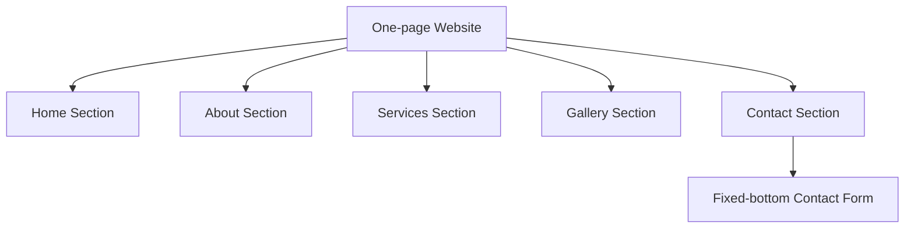

## 1. Product Overview
A single-page painting contractor website with a light grey background and clearly separated sections: Home, About, Services, Gallery, and Contact.
It helps potential customers quickly understand offerings, view past work, and send an inquiry via a contact form anchored to the bottom of the page content.

## 2. Core Features

### 2.1 Feature Module
This website consists of the following main page:
1. **One-page Website**: top navigation with section links, Home/About/Services/Gallery/Contact sections, and a contact form fixed at the bottom of the page content.

### 2.2 Page Details
| Page Name | Module Name | Feature description |
|-----------|-------------|---------------------|
| One-page Website | Global layout & theme | Apply light grey background; keep readable content width and consistent spacing across sections. |
| One-page Website | Top navigation | Jump to Home/About/Services/Gallery/Contact sections via anchor links. |
| One-page Website | Home section | Present contractor name/tagline and a primary call-to-action to contact. |
| One-page Website | About section | Explain who you are and what you specialize in. |
| One-page Website | Services section | List core painting services in a scannable format. |
| One-page Website | Gallery section | Display a grid of project images. |
| One-page Website | Contact section | Show contact details and provide an inquiry form. |
| One-page Website | Fixed-bottom contact form | Keep the form visually anchored at the bottom of the page content so it’s always easy to find. |

## 3. Core Process
- Visitor arrives on the page and uses the top navigation to jump to relevant sections.
- Visitor reviews services and scans the gallery for quality/fit.
- Visitor goes to Contact and submits an inquiry using the fixed-bottom contact form.

