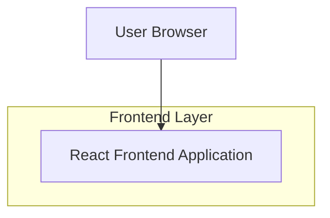

## 1.Architecture design

## 2.Technology Description
- Frontend: React@18 + vite + tailwindcss@3
- Backend: None

## 3.Route definitions
| Route | Purpose |
|-------|---------|
| / | Single-page layout with Home/About/Services/Gallery/Contact sections and fixed-bottom contact form |
